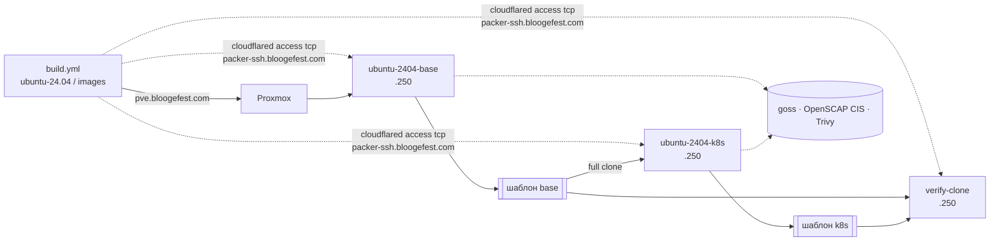

# packer-images

[](https://scorecard.dev/viewer/?uri=github.com/sogeor/packer-images)
[](https://github.com/sogeor/packer-images/actions/workflows/validate.yml)

Образы узлов платформы sogeor: шаблоны Proxmox и схема Talos Image Factory.

## Образы

| Образ | Цель | Билдер | Теги Proxmox |
|---|---|---|---|
| `ubuntu-2404-base` | Proxmox | `proxmox-iso`, autoinstall (`cidata`) | `packer;ubuntu-2404;base;v<build>` |
| `ubuntu-2404-k8s` | Proxmox | `proxmox-clone` от base | `packer;ubuntu-2404;k8s;k8s-<maj>-<min>;v<build>` |
| `talos` | Все | Talos Image Factory, [`talos/schematic.yaml`](talos/schematic.yaml) | `talos-<version>-<schematic>` |

## Сборка



| Этап | base | k8s |
|---|---|---|
| Установка | ISO 24.04.5, autoinstall, статический IP | Клон base, cloud-init |
| Настройка | `update`, `packages`, `ansible/image.yml` | `update`, `kubernetes` |
| Проверки | goss, OpenSCAP, Trivy | goss, OpenSCAP, Trivy |
| Очистка | machine-id, ключи хоста, логи, cloud-init, пользователь сборки | то же |

## Образ

- Паролей нет; SSH только по ключам, `PermitRootLogin no`. Ключ сборки временный, пользователь сборки удаляется.
- `datasource_list: [NoCloud, ConfigDrive]`, удалён `subiquity-disable-cloudinit-networking.cfg`.
- Swap отключён.
- k8s: containerd 2.x (`SystemdCgroup`), `overlay`/`br_netfilter`, sysctl, kubeadm/kubelet/kubectl с `hold`,
  образы control plane загружены заранее.

## Отчёты

`reports/<template>/`:

| Файл | |
|---|---|
| `*-goss.xml` | goss, JUnit |
| `*-openscap.html`, `*-openscap-arf.xml`, `*-openscap-results.xml` | CIS Ubuntu 24.04 L1 Server + [tailoring](tests/openscap) |
| `*-openscap-summary.json` | Счётчики, процент, проваленные правила |
| `*-openscap-remediation.yml` | Ansible-исправления для проваленных правил |
| `*-trivy.json`, `*-sbom.cdx.json` | Уязвимости, SBOM CycloneDX |

## Быстрый старт

```bash
tools/packer.sh fmt
tools/packer.sh init ubuntu-2404-base
tools/packer.sh validate ubuntu-2404-base --syntax-only
```

Из домашней сети или с `PACKER_SSH_HOSTNAME` (переменные — [MANUAL_STEPS.md](MANUAL_STEPS.md)):

```bash
PKR_VAR_build_version="$(date +%Y%m%d).0" tools/packer.sh build ubuntu-2404-base
PKR_VAR_build_version="$(date +%Y%m%d).0" PKR_VAR_base_template="$(tools/find-template.sh ubuntu-2404 base)" \
  tools/packer.sh build ubuntu-2404-k8s
tools/verify-clone.sh "$(tools/find-template.sh ubuntu-2404 k8s)"
```

`tools/packer.sh` собирает `common/*.pkr.hcl` и `images/<image>/` в `.build/<image>/` и подключает
`<image>.pkrvars.hcl`. Локальные значения — `*.auto.pkrvars.hcl`.

## Структура

```
common/                 # плагины, общие переменные
images/<image>/         # build.pkr.hcl, variables.pkr.hcl, <image>.pkrvars.hcl, cidata/
scripts/common/         # cloud-init, пользователь сборки, goss, OpenSCAP, Trivy
scripts/debian-family/  # update, packages, kubernetes, cleanup
ansible/                # image.yml, requirements.yml
tests/goss/             # base.yaml, k8s.yaml
tests/openscap/         # tailoring
talos/                  # schematic.yaml
tools/                  # packer.sh, find-template.sh, verify-clone.sh, prune-templates.sh
```

## Переменные

| Переменная | Источник | |
|---|---|---|
| `PROXMOX_URL` | Environment `images`, variable | `https://pve.bloogefest.com/api2/json` |
| `PROXMOX_USERNAME` | Environment `images`, variable | `packer@pve!ci` |
| `PROXMOX_TOKEN` | Environment `images`, secret | |
| `PACKER_SSH_HOSTNAME` | Environment `images`, variable | `packer-ssh.bloogefest.com`; без неё SSH напрямую к `192.168.100.250` |
| `PROXMOX_CA_FILE` | опционально | CA Proxmox для `tools/*.sh` |
| `PKR_VAR_build_version` | CI / вручную | |
| `PKR_VAR_base_template` | CI / вручную | |

## Версии

| Компонент | Версия |
|---|---|
| Packer | 1.16.1 |
| `hashicorp/proxmox` | 1.2.4 |
| `hashicorp/ansible` | 1.1.6 |
| Ubuntu Server | 24.04.5 LTS |
| cloudflared (CI) | 2026.10.0 |
| ansible-core (CI) | 2.21.5 |
| Kubernetes | 1.37.1 (`1.37.1-1.1`, pkgs.k8s.io) |
| containerd | ≥ 2.0, Ubuntu noble-updates |
| `ansible.posix` | 2.2.2 |
| goss | 0.4.9 |
| Trivy | 0.75.0 |
| SCAP Security Guide | 0.1.82 |
| Talos Linux | 1.14.2 |
| actions/checkout | v7.0.1 |
| actions/upload-artifact | v7.0.1 |
| hashicorp/setup-packer | v3.4.0 |
| ossf/scorecard-action | v2.4.4 |
| github/codeql-action | v4.38.2 |
| actionlint | 1.7.12 |
| gitleaks | 8.30.1 |
| zizmor | 1.30.1 |
| yamllint | 1.38.0 |
| ansible-lint | 26.9.0 |
| shellcheck | 0.11.0 |

## Ссылки

- [MANUAL_STEPS.md](MANUAL_STEPS.md)
- [docs/adr-drafts](docs/adr-drafts)
- [SECURITY.md](SECURITY.md)

## Лицензия

[Apache-2.0](LICENSE)
