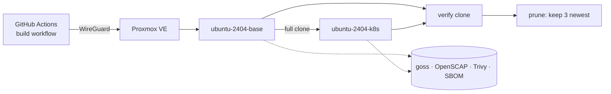

# images

Hardened, scanned virtual machine images for the sogeor platform.

[](https://github.com/sogeor/images/actions/workflows/validate.yml)
[](https://github.com/sogeor/images/actions/workflows/docs.yml)
[](https://scorecard.dev/viewer/?uri=github.com/sogeor/images)
[](https://www.bestpractices.dev/projects/15317)
[](LICENSE)

## Overview

- Builds **Proxmox VE templates** with Packer: `ubuntu-2404-base` and `ubuntu-2404-k8s`.
- **Secure by default:** no passwords, SSH keys only, ephemeral build key, identity reset on clone.
- **Verified every build:** goss checks, OpenSCAP CIS Level 1 Server report, Trivy scan and CycloneDX SBOM.
- **Kubernetes-ready:** containerd 2.x, kubeadm/kubelet/kubectl held, control plane images pre-pulled.
- **Automated lifecycle:** monthly rebuilds, clone verification, pruning of old templates, Renovate updates.
- **Talos Linux:** Image Factory schematic as code with published image URLs.



## Quick start

```bash
git clone https://github.com/sogeor/images.git && cd images
tools/packer.sh init ubuntu-2404-base
tools/packer.sh validate ubuntu-2404-base --syntax-only
PKR_VAR_build_version="$(date +%Y%m%d)-0" tools/packer.sh build ubuntu-2404-base
```

Requires Packer, Python and a Proxmox VE API token: see [Getting started](docs/getting-started.md).

## Documentation

| Page | What is inside |
|---|---|
| [Overview](docs/index.md) | Purpose, outputs, place in the platform |
| [Getting started](docs/getting-started.md) | From zero to the first verified template |
| [Repository setup](docs/setup.md) | GitHub settings, Proxmox token, CI network, Environment, Renovate, Scorecard |
| [Configuration](docs/configuration.md) | Every variable, environment variable, workflow input and secret |
| [Usage](docs/usage.md) | Builds, verification, template lookup, reports, Talos |
| [Operations](docs/operations.md) | Monthly rebuild, updates, rollback, pruning, credential rotation, new OS |
| [Architecture](docs/architecture.md) | Components, pipeline, network, lifecycle, contract |
| [Security](docs/security.md) | Guarantees, limits, assurance case |
| [Troubleshooting](docs/troubleshooting.md) | Symptoms, causes and fixes |
| [Reference](docs/reference/workflows.md) | [Workflows](docs/reference/workflows.md), [scripts](docs/reference/scripts.md), [names and tags](docs/reference/tags.md) |
| [Decisions](docs/adr/index.md) | Architecture decision records |

Preview locally: `pip install --require-hashes -r .github/requirements-docs.txt && mkdocs serve`.

## Supported matrix

| OS | Proxmox VE | OpenStack (Selectel, VK Cloud) | Yandex Cloud | Status |
|---|---|---|---|---|
| Ubuntu Server 24.04 LTS | base, k8s | planned | planned | stable |
| Ubuntu Server 26.04 LTS | planned | planned | planned | planned |
| Astra Linux SE 1.8 | planned | — | — | planned |
| Alpine Linux | planned | planned | — | experimental |
| Talos Linux | Image Factory | Image Factory | Image Factory | stable |

## Versions

| Component | Version |
|---|---|
| Packer | 1.16.1 |
| `hashicorp/proxmox` | 1.2.4 |
| `hashicorp/ansible` | 1.1.6 |
| Ubuntu Server | 24.04.5 LTS |
| ansible-core (CI) | 2.21.5 |
| Kubernetes | 1.37.1 (`1.37.1-1.1`, pkgs.k8s.io) |
| containerd | ≥ 2.0, Ubuntu noble-updates |
| `ansible.posix` | 2.2.2 |
| goss | 0.4.9 |
| Trivy | 0.75.0 |
| SCAP Security Guide | 0.1.82 |
| Talos Linux | 1.14.2 |
| actions/checkout | v7.0.1 |
| actions/upload-artifact | v7.0.2 |
| hashicorp/setup-packer | v3.4.0 |
| ossf/scorecard-action | v2.4.4 |
| github/codeql-action | v4.38.3 |
| DavidAnson/markdownlint-cli2-action | v24.2.0 |
| lycheeverse/lychee-action | v2.9.0 |
| markdownlint-cli2 (pre-commit) | 0.23.3 |
| mkdocs-material | 9.7.7 |
| actionlint | 1.7.12 |
| gitleaks | 8.30.1 |
| zizmor | 1.30.1 |
| yamllint | 1.38.0 |
| ansible-lint | 26.9.0 |
| shellcheck | 0.11.0 |

Python tools are locked with hashes (`*.in` → `*.txt` by pip-compile, header kept for Renovate): `tools/requirements-ci.txt`,
`.github/requirements-lint.txt`, `.github/requirements-docs.txt`. Regeneration: [Operations](docs/operations.md#update-locked-python-dependencies).

## Contributing

See [CONTRIBUTING.md](CONTRIBUTING.md). Governance: [GOVERNANCE.md](GOVERNANCE.md).
Plans: [ROADMAP.md](ROADMAP.md). Conduct: [CODE_OF_CONDUCT.md](CODE_OF_CONDUCT.md).
Changes: [CHANGELOG.md](CHANGELOG.md).

## Security

Report vulnerabilities privately as described in [SECURITY.md](SECURITY.md).
What the images guarantee: [docs/security.md](docs/security.md).

## License

[Apache-2.0](LICENSE)
