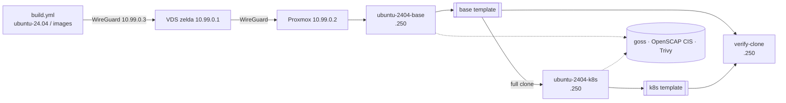

# packer-images

[](https://scorecard.dev/viewer/?uri=github.com/sogeor/packer-images)
[](https://www.bestpractices.dev/projects/15317)
[](https://github.com/sogeor/packer-images/actions/workflows/validate.yml)

Node images for the sogeor platform: Proxmox templates and the Talos Image Factory schematic.

## Images

| Image | Target | Builder | Proxmox tags |
|---|---|---|---|
| `ubuntu-2404-base` | Proxmox | `proxmox-iso`, autoinstall (`cidata`) | `packer;ubuntu-2404;base;v<build>` |
| `ubuntu-2404-k8s` | Proxmox | `proxmox-clone` of base | `packer;ubuntu-2404;k8s;k8s-<maj>-<min>;v<build>` |
| `talos` | Any | Talos Image Factory, [`talos/schematic.yaml`](talos/schematic.yaml) | `talos-<version>-<schematic>` |

## Build



| Stage | base | k8s |
|---|---|---|
| Install | ISO 24.04.5, autoinstall, static IP | Clone of base, cloud-init |
| Configure | `update`, `packages`, `ansible/image.yml` | `update`, `kubernetes` |
| Verify | goss, OpenSCAP, Trivy | goss, OpenSCAP, Trivy |
| Clean up | machine-id, host keys, logs, cloud-init, build user | same |

Builds run monthly and on demand (`workflow_dispatch`), from `master` only. After a successful clone check,
the `prune` job keeps the 3 latest templates of each image.

## Image properties

- No passwords; SSH by keys only, `PermitRootLogin no`, PAM without `nullok`. The build key is ephemeral and the build user is removed.
- `datasource_list: [NoCloud, ConfigDrive]`; `subiquity-disable-cloudinit-networking.cfg` removed.
- Swap disabled.
- k8s: containerd 2.x (`SystemdCgroup`), `overlay`/`br_netfilter`, sysctl, kubeadm/kubelet/kubectl on `hold`,
  control plane images pre-pulled.

## Reports

Published as workflow artifacts, `reports/<template>/`:

| File | |
|---|---|
| `*-goss.xml` | goss, JUnit |
| `*-openscap.html`, `*-openscap-arf.xml`, `*-openscap-results.xml` | CIS Ubuntu 24.04 L1 Server + [tailoring](tests/openscap) |
| `*-openscap-summary.json` | Counts, score, failed rules |
| `*-openscap-remediation.yml` | Ansible remediation for failed rules |
| `*-trivy.json`, `*-sbom.cdx.json` | Vulnerabilities, CycloneDX SBOM |

## Quick start

```bash
tools/packer.sh fmt
tools/packer.sh init ubuntu-2404-base
tools/packer.sh validate ubuntu-2404-base --syntax-only
```

From the home network (see [Variables](#variables)):

```bash
PKR_VAR_build_version="$(date +%Y%m%d)-0" tools/packer.sh build ubuntu-2404-base
PKR_VAR_build_version="$(date +%Y%m%d)-0" PKR_VAR_base_template="$(tools/find-template.sh ubuntu-2404 base)" \
  tools/packer.sh build ubuntu-2404-k8s
tools/verify-clone.sh "$(tools/find-template.sh ubuntu-2404 k8s)"
```

`tools/packer.sh` assembles `common/*.pkr.hcl` and `images/<image>/` into `.build/<image>/` and adds
`<image>.pkrvars.hcl`. Local overrides go to `*.auto.pkrvars.hcl`.

## Layout

```
common/                 # plugins, shared variables
images/<image>/         # build.pkr.hcl, variables.pkr.hcl, <image>.pkrvars.hcl, cidata/
scripts/common/         # cloud-init, build user, goss, OpenSCAP, Trivy
scripts/debian-family/  # update, packages, kubernetes, cleanup
ansible/                # image.yml, requirements.yml
tests/goss/             # base.yaml, k8s.yaml
tests/openscap/         # tailoring
talos/                  # schematic.yaml
tools/                  # packer.sh, find-template.sh, verify-clone.sh, prune-templates.sh, ci-*.sh
```

## Variables

| Variable | Source | |
|---|---|---|
| `PROXMOX_URL` | Environment `images`, variable | `https://192.168.100.10:8006/api2/json` |
| `PROXMOX_USERNAME` | Environment `images`, variable | `packer@pve!ci` |
| `PROXMOX_TOKEN` | Environment `images`, secret | |
| `WG_ENDPOINT`, `WG_SERVER_PUBLIC_KEY` | Environment `images`, variable | `161.104.47.226:51820`, VDS public key |
| `WG_RUNNER_PRIVATE_KEY` | Environment `images`, secret | runner key (`10.99.0.3`) |
| `PROXMOX_CA_PEM` | Environment `images`, variable | Proxmox CA |
| `SCORECARD_TOKEN` | Repository secret | fine-grained PAT, Administration: read-only |
| `PROXMOX_CA_FILE` | optional | Proxmox CA for `tools/*.sh` |
| `PKR_VAR_build_version` | CI / manual | |
| `PKR_VAR_base_template` | CI / manual | |

## Versions

| Component | Version |
|---|---|
| Packer | 1.16.1 |
| `hashicorp/proxmox` | 1.2.4 |
| `hashicorp/ansible` | 1.1.6 |
| Ubuntu Server | 24.04.5 LTS |
| ansible-core (CI) | 2.21.5 |
| Kubernetes | 1.37.1 (`1.37.1-1.1`, pkgs.k8s.io) |
| containerd | ≥ 2.0, Ubuntu noble-updates |
| `ansible.posix` | 2.2.2 |
| goss | 0.4.9 |
| Trivy | 0.75.0 |
| SCAP Security Guide | 0.1.82 |
| Talos Linux | 1.14.2 |
| actions/checkout | v7.0.1 |
| actions/upload-artifact | v7.0.1 |
| hashicorp/setup-packer | v3.4.0 |
| ossf/scorecard-action | v2.4.4 |
| github/codeql-action | v4.38.2 |
| actionlint | 1.7.12 |
| gitleaks | 8.30.1 |
| zizmor | 1.30.1 |
| yamllint | 1.38.0 |
| ansible-lint | 26.9.0 |
| shellcheck | 0.11.0 |

Python tools are locked with hashes: `tools/requirements-ci.txt`, `.github/requirements-lint.txt` (generated from `*.in` by pip-compile).

## Contributing

See [CONTRIBUTING.md](CONTRIBUTING.md): process, tests and coding standards. Project governance is in
[GOVERNANCE.md](GOVERNANCE.md), plans in [ROADMAP.md](ROADMAP.md), conduct rules in [CODE_OF_CONDUCT.md](CODE_OF_CONDUCT.md).

## Links

- [Architecture](docs/architecture.md)
- [Security](docs/security.md)
- [docs/adr-drafts](docs/adr-drafts)
- [SECURITY.md](SECURITY.md)
- [CHANGELOG.md](CHANGELOG.md)

## License

[Apache-2.0](LICENSE)
