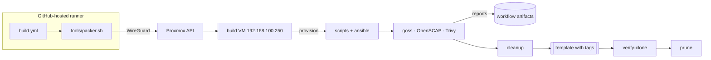

# Architecture

## Purpose

`packer-images` produces VM templates for the nodes of the sogeor platform. Downstream
repositories (`infra`, `mgmt-infra`) find templates by Proxmox tags and clone them; they never
depend on how a template was built.

## Components

| Component | Role |
|---|---|
| `images/<image>/` | Packer template per image: builder, provisioners, variables |
| `common/` | Plugin pins and variables shared by all images |
| `scripts/` | Provisioning scripts run inside the build VM |
| `ansible/image.yml` | Image-level configuration (SSH, cloud-init) |
| `tests/goss/`, `tests/openscap/` | Acceptance checks and the CIS tailoring |
| `tools/packer.sh` | Assembles `common/` and an image into `.build/<image>/` and runs Packer |
| `tools/verify-clone.sh` | Boots a clone of a template and checks it |
| `tools/prune-templates.sh` | Keeps the N latest templates of an image |
| `.github/workflows/` | `validate` (every push/PR), `build` (monthly/manual), `scorecard` |

## Build pipeline

1. `ubuntu-2404-base` is installed from the Ubuntu ISO (sha256-verified) with autoinstall from a `cidata` CD.
2. `ubuntu-2404-k8s` is a full clone of the newest base template plus containerd and Kubernetes.
3. Each build runs goss, OpenSCAP and Trivy, uploads reports, cleans identity data and converts the VM to a template.
4. `verify-clone` boots a clone and checks cloud-init, SSH and goss; `prune` keeps the 3 latest templates.

## Network

The runner joins a WireGuard network (`10.99.0.0/24`) through the VDS hub and reaches only the
Proxmox API (`192.168.100.10:8006`) and SSH of the build VM (`192.168.100.250:22`). Nothing in the
home network is exposed to the internet. See [ADR 0003](adr-drafts/0003-ci-wireguard.md).

## Interface (contract)

| Output | Format |
|---|---|
| Template name | `ubuntu-2404-<kind>-v<run>-<attempt>` |
| Proxmox tags | `packer;ubuntu-2404;base;v<build>`, `packer;ubuntu-2404;k8s;k8s-<maj>-<min>;v<build>` |
| Description | build version and git SHA |
| Reports | `reports-<image>` workflow artifact |

Consumers select the newest template by tags; existing VMs are not recreated when a new template appears.
