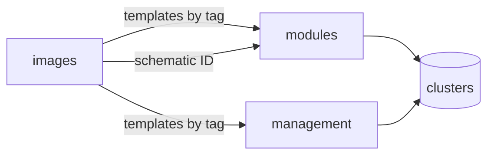

# sogeor images

Hardened virtual machine images for the [sogeor platform](https://github.com/sogeor).
The repository builds Proxmox VE templates with Packer and publishes the Talos Linux
Image Factory schematic used by Talos clusters.

## Who this is for

- **Platform operators** who need ready, scanned node images for Kubernetes clusters.
- **Engineers adopting the platform** who want to build the same images in their own Proxmox VE or cloud.
- **Reviewers** who want to see how images are built, verified and kept up to date.

## What you get

| Output | Description |
|---|---|
| `ubuntu-2404-base` template | Ubuntu Server 24.04 LTS, SSH keys only, no passwords, CIS-scanned, cloud-init ready |
| `ubuntu-2404-k8s` template | The base template plus containerd 2.x, kubeadm, kubelet, kubectl and pre-pulled control plane images |
| Reports per template | goss results, OpenSCAP CIS Level 1 Server report and remediation, Trivy vulnerabilities, CycloneDX SBOM |
| Talos schematic | Image Factory schematic ID and image URLs for Talos nodes |

## Supported matrix

| OS | Proxmox VE | OpenStack (Selectel, VK Cloud) | Yandex Cloud | Status |
|---|---|---|---|---|
| Ubuntu Server 24.04 LTS | base, k8s | planned | planned | stable |
| Ubuntu Server 26.04 LTS | planned | planned | planned | planned |
| Astra Linux SE 1.8 | planned | — | — | planned |
| Alpine Linux | planned | planned | — | experimental |
| Talos Linux | Image Factory | Image Factory | Image Factory | stable |

## Place in the platform

- `modules` and `management` (planned repositories of the platform) find the newest template by tags and clone it.
- Contract for names and tags: [Names and tags](reference/tags.md).

## Where to start

| Goal | Page |
|---|---|
| Build the first template | [Getting started](getting-started.md) |
| Set up a fork with CI | [Repository setup](setup.md) |
| Look up an option | [Configuration](configuration.md) |
| Run builds and read reports | [Usage](usage.md) |
| Update, roll back, clean up | [Operations](operations.md) |
| Understand the design | [Architecture](architecture.md), [Decisions](adr/index.md) |
| Security guarantees | [Security](security.md) |
| Fix a failure | [Troubleshooting](troubleshooting.md) |
